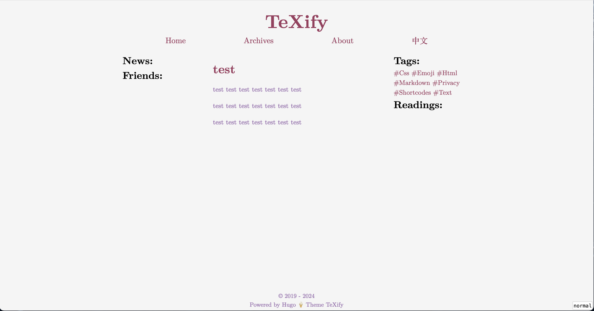
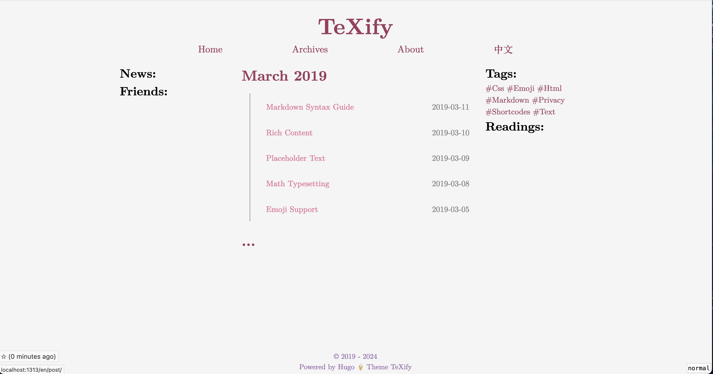

# Life

A minimal, latex-style hugo theme for personal blogging. A fork of [hugo-theme-texify](https://github.com/queensferryme/hugo-theme-texify).





## Features

- [Giscus](https://giscus.app/) & Google Analytics included
- Responsive design for mobile devices
- Customize the site with your own stylesheets
- Math equations powered by [KaTeX](https://katex.org/) or [MathJax](https://www.mathjax.org/)
- Minimal CSS, No JavaScript, Blazing Fast!
- Sidebar Support (You can disable it).
- Multi-language support (English, Simplified Chinese)

## Usage

Install with:

```bash
git submodule add https://github.com/queensferryme/hugo-theme-life.git themes/hugo-theme-life
```

Upgrade with:

```bash
git submodule update --recursive --remote themes/hugo-theme-life
```

Then, add the following line to your `config.toml`:

See [`config.toml`](https://github.com/zhixiao-zhang/hugo-theme-life/blob/master/config.toml) for an example configuration.

Note that for Simplified Chinese users, it is recommended to use [Noto Serif SC](https://fonts.google.com/specimen/Noto+Serif+SC) via Google Fonts. You may put the following codes in your `static/css/custom.css`:

```css
@import url('https://fonts.googleapis.com/css2?family=Noto+Serif+SC:wght@300;700&display=swap');

#wrapper {
    font-family: 'Latin Modern Roman', 'Times New Roman', 'Noto Serif SC', serif;
}
```

## Development

```bash
make dev
```

## Acknowledgement

The design of this theme is inspired by the following softwares:

- https://queensferryme/hugo-theme-texify/ (it doesn't update anymore)
- https://github.com/vincentdoerig/latex-css
- https://github.com/7ma7X/HugoTeX
- https://theme.typora.io/theme/Academic/
